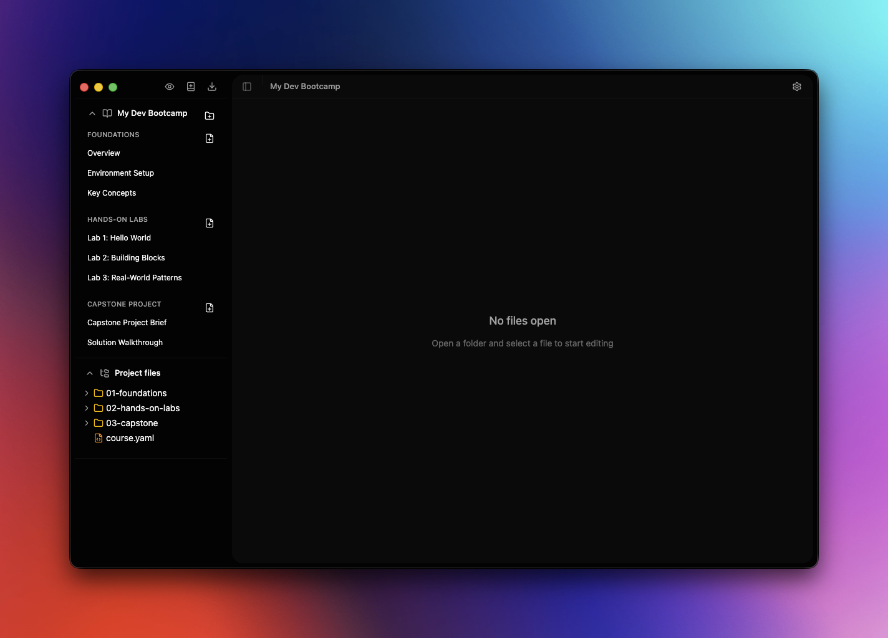
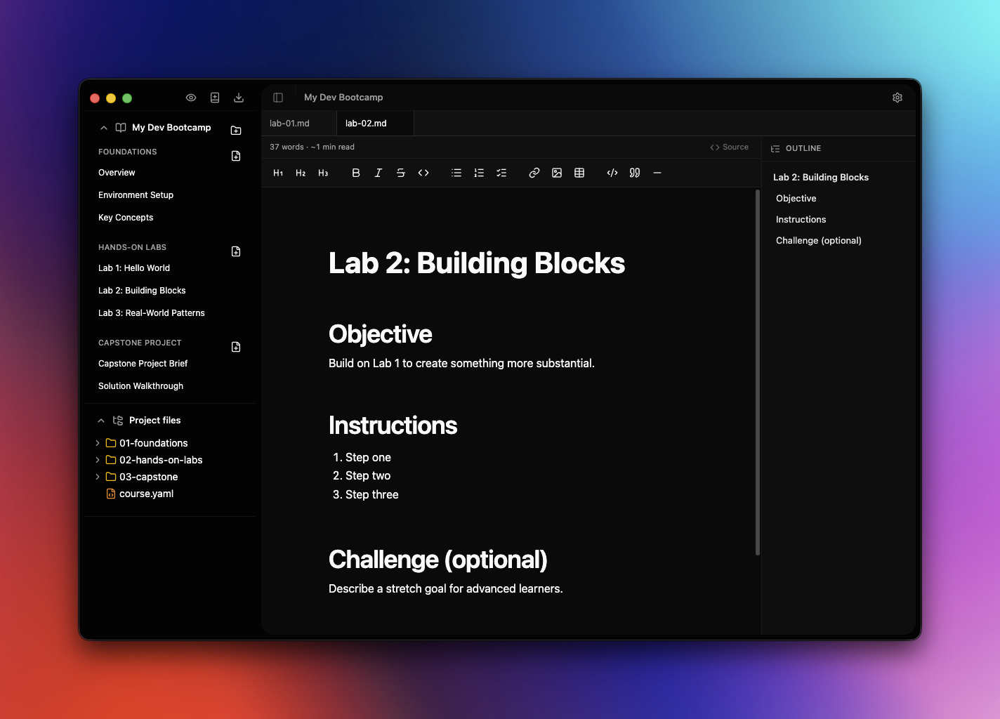
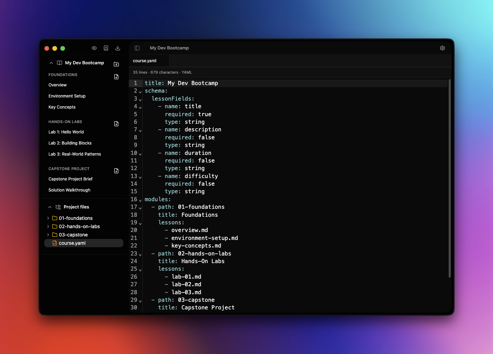
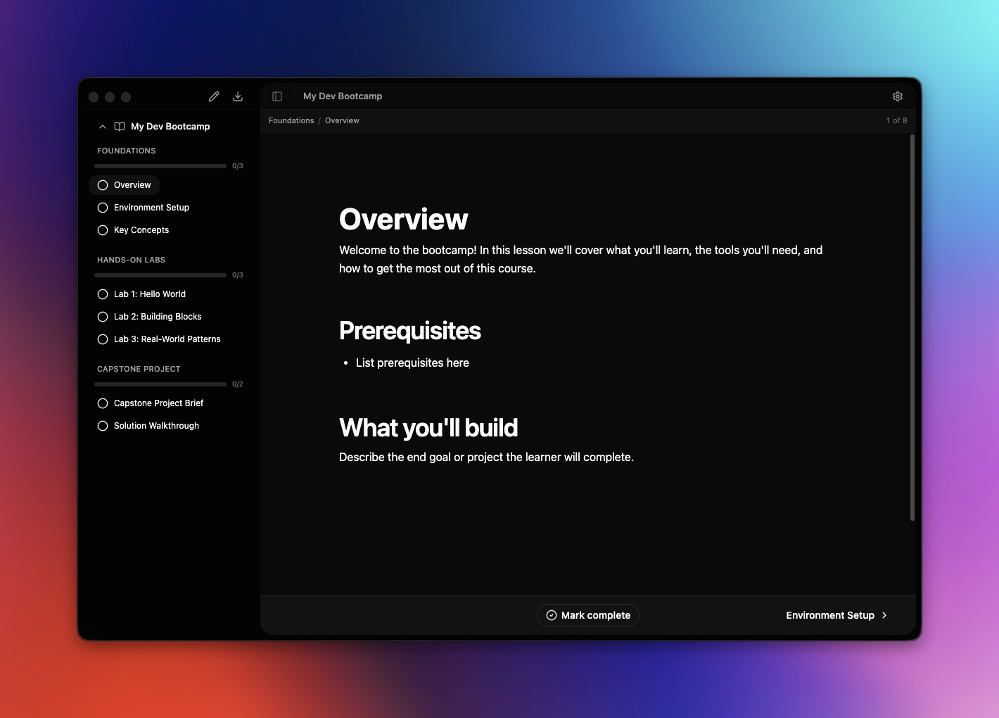
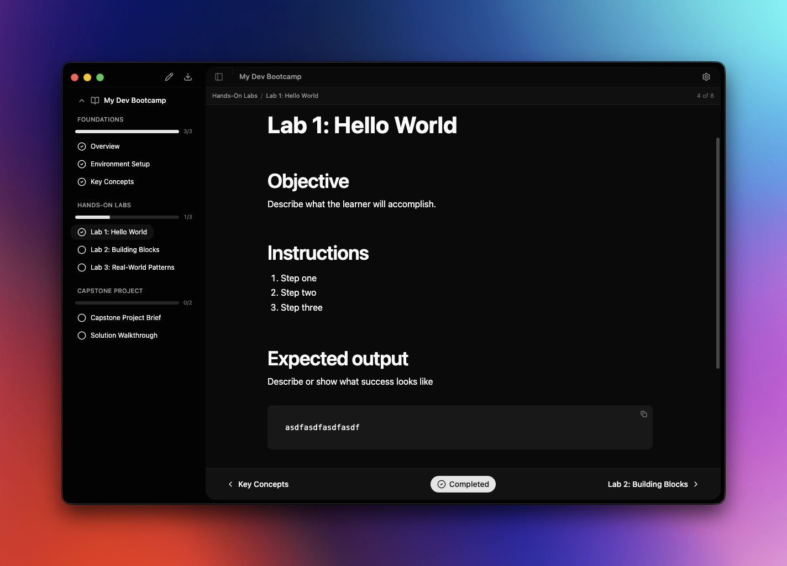
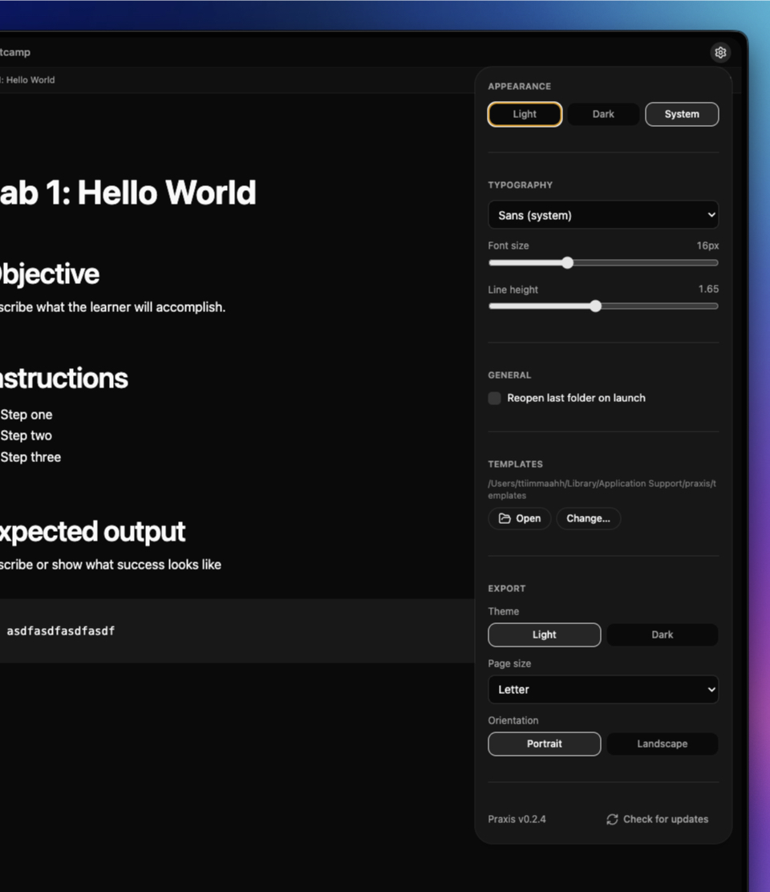

<div align="center">
  

  <h1>Praxis</h1>

  <p>
    <strong>A desktop course authoring and learning platform for technical developer training.</strong>
  </p>

  <p>
    Built with Electron, React, TypeScript, and Plate.js.
  </p>

  <p>
    <a href="https://github.com/ttiimmaahh/praxis/releases"></a>
    <a href="https://github.com/ttiimmaahh/praxis/blob/main/LICENSE"></a>
    
  </p>
</div>

## Features

- Rich Markdown editing powered by [Plate.js](https://platejs.org) — live WYSIWYG with full keyboard support
- File tree sidebar with workspace management and dirty-state tracking
- Course authoring: define modules and lessons in `course.yaml`
- Learner mode: read-only course navigation with progress tracking
- Course templates: scaffold new courses from built-in or custom templates
- Content schemas: validate lesson frontmatter against a defined schema
- **Export to HTML and PDF** — single documents or entire courses, with customizable theme, page size, and orientation
- Customizable appearance: theme, font, font size, line height
- Workspace search across all Markdown files
- Command palette (`⌘⇧P`) for fast keyboard-driven navigation
- Session persistence (open tabs, sidebar width, theme settings)
- Auto-updating on all platforms (macOS is signed + notarized)

## Screenshots

<!--
  Screenshots live in docs/images/ so they never ship inside the packaged app
  (docs/** is excluded via electron-builder.yml). To refresh a screenshot, just
  replace the file in docs/images/ with the same name.
-->

### Workspace overview

A course workspace with modules, lessons, and project files in the sidebar — no file open yet.



### Editing a lesson

WYSIWYG Markdown editing with the formatting toolbar, tabbed files, and a live outline of headings.



### Course authoring

`course.yaml` open in the editor, showing the content schema and module/lesson structure that drives the course.



### Learner mode

Reading a course in learner mode: lesson list, progress indicator, and prev/next navigation.



### Progress tracking

Per-module progress bars and a "Completed" pill as lessons are marked done.



### Settings & export preferences

Appearance, typography, templates, and export preferences (theme, page size, orientation) all live in a single settings panel.



## Getting Started

```bash
npm install
npm run dev
```

## Course Templates

Templates define the starting structure for a new course. When you create a new course, a template picker lets you choose which structure to start with.

### Template directory

Templates are stored as `.yaml` files in a templates directory:

- **Default location**: `~/Library/Application Support/Praxis/templates/` (macOS), or the equivalent `userData` path on Windows/Linux
- **Custom location**: Set via Settings (gear icon) > Templates > Change...

The app seeds built-in templates into this directory on first launch.

### Built-in templates

| Template | Structure | Schema |
|----------|-----------|--------|
| **Multi-Module Tutorial** | 3 modules, 2 lessons each | title (required), description, duration |
| **Single-Module Workshop** | 1 module, 3 lessons | title (required), description |
| **Blank** | 1 module, 1 lesson | none |

### Creating a custom template

1. Open the templates directory (Settings > Templates > Open)
2. Copy an existing `.yaml` file or create a new one
3. Edit the YAML to define your course structure
4. Save — the template appears in the picker on next "New course..."

### Template file format

Each template is a single `.yaml` file with this structure:

```yaml
# Required: display name shown in the template picker
name: My Custom Template

# Required: short description shown below the name
description: A brief explanation of what this template creates

# Optional: content schema for frontmatter validation
# If provided, this schema is written into the scaffolded course.yaml
schema:
  lessonFields:
    - name: title        # field name in frontmatter
      required: true     # whether the field must be present
      type: string       # 'string' or 'number'
    - name: description
      required: false
      type: string
    - name: duration
      required: false
      type: string

# Required: list of modules to scaffold
modules:
  - folder: 01-introduction    # folder name created on disk
    title: Introduction         # module title in course.yaml
    lessons:
      - file: welcome.md       # lesson filename
        title: Welcome          # lesson title in course.yaml
        body: |                 # full file content (including frontmatter)
          ---
          title: Welcome
          description: ""
          duration: ""
          ---

          # Welcome

          Start writing your lesson here.

      - file: getting-started.md
        title: Getting Started
        body: |
          ---
          title: Getting Started
          description: ""
          duration: ""
          ---

          # Getting Started

          Describe the first steps here.

  - folder: 02-advanced
    title: Advanced Topics
    lessons:
      - file: deep-dive.md
        title: Deep Dive
        body: |
          ---
          title: Deep Dive
          ---

          # Deep Dive

          Cover advanced material here.
```

### Field reference

| Field | Required | Description |
|-------|----------|-------------|
| `name` | Yes | Display name in the template picker |
| `description` | Yes | Short description shown in the picker |
| `schema` | No | Content schema written into `course.yaml` |
| `schema.lessonFields` | Yes (if schema) | Array of field definitions |
| `schema.lessonFields[].name` | Yes | Frontmatter field name |
| `schema.lessonFields[].required` | No | `true` if the field must be present (default: `false`) |
| `schema.lessonFields[].type` | No | `'string'` or `'number'` (default: `'string'`) |
| `modules` | Yes | Array of module definitions |
| `modules[].folder` | Yes | Directory name for the module |
| `modules[].title` | Yes | Display title for the module |
| `modules[].lessons` | Yes | Array of lesson definitions |
| `modules[].lessons[].file` | Yes | Markdown filename |
| `modules[].lessons[].title` | Yes | Display title for the lesson |
| `modules[].lessons[].body` | Yes | Full content of the lesson file (use YAML `\|` for multiline) |

### Sharing templates

Template files are plain YAML. Share them by:
- Copying the `.yaml` file to another machine's templates directory
- Committing templates to a shared Git repository
- Distributing via any file sharing method

## Content Schemas

Schemas define expected frontmatter fields for lesson files. When a schema is defined in `course.yaml`, the app validates each lesson's frontmatter and shows warnings for missing required fields.

### Defining a schema in course.yaml

Add a `schema` key at the root of your `course.yaml`:

```yaml
title: My Course
schema:
  lessonFields:
    - name: title
      required: true
      type: string
    - name: description
      required: false
      type: string
    - name: duration
      required: false
      type: string
modules:
  - path: 01-module
    title: Module 1
    lessons:
      - lesson-01.md
```

### How validation works

- When the course manifest loads, each lesson file's frontmatter is checked against the schema
- Missing **required** fields produce warnings (not errors) — the course still loads
- Warnings appear in the course panel alongside other manifest warnings (e.g., missing files)
- Optional fields are not validated for presence
- Schemas are portable: they live in `course.yaml` and travel with the repo

### Example lesson with frontmatter

```markdown
---
title: Introduction to TypeScript
description: Learn the basics of TypeScript type system
duration: 15 min
---

# Introduction to TypeScript

Content goes here...
```

If the schema requires `title` and this lesson omits it, a warning will appear:
`Lesson "01-module/lesson-01.md": missing required field "title"`

## Development

```bash
npm run dev      # Start in development mode
npm run build    # Build for production
npm run lint     # Run ESLint
```

## Installing & Updating

Praxis ships for macOS (DMG, ZIP), Windows (NSIS installer), and Linux (AppImage, DEB). Grab the latest build from the [Releases](https://github.com/ttiimmaahh/praxis/releases) page.

The macOS build is **universal** — a single DMG works on both Apple Silicon and Intel Macs.

### Code signing

| Platform | Signing | Auto-update |
|----------|---------|-------------|
| Windows  | **Unsigned** — SmartScreen will show a warning on first launch; click "More info" → "Run anyway". No plans to purchase a code-signing certificate. | Works out of the box. |
| macOS    | **Signed with Developer ID Application & notarized by Apple** (v0.2.3+). Opens cleanly via Gatekeeper on first launch. | **Works** for v0.2.3 and later. Updating from v0.2.2 or earlier (unsigned) to v0.2.3 requires a one-time manual download from Releases — Squirrel.Mac cannot bridge the identity change from ad-hoc to Developer ID. Every subsequent release auto-updates normally. |
| Linux    | Unsigned. | Works via AppImage's built-in update mechanism where supported. |

